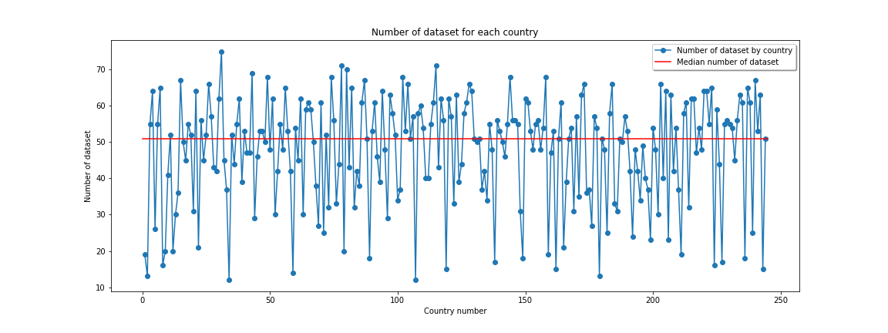

# Project of Data Visualization (COM-480)

| Student's name | SCIPER |
| -------------- | ------ |
|Maxime Dulon|302709|
|Francesca Paola Nicoletti |273034|
| Kieran Vaudaux| 287703|

[Milestone 1](#milestone-1) • [Milestone 2](#milestone-2) • [Milestone 3](#milestone-3)

## Milestone 1 (23rd April, 5pm)

**10% of the final grade**

This is a preliminary milestone to let you set up goals for your final project and assess the feasibility of your ideas.
Please, fill the following sections about your project.

*(max. 2000 characters per section)*

### Dataset

We have chosen to focus on the dataset, [Energy Statistics Database](http://data.un.org/Explorer.aspx), published by the United Nations Statistics Division on the UNData site. All data and metadata provided on UNdata website are available free of charge and may be copied freely, duplicated and further distributed provided that UNdata is cited as the reference. The Energy Statistics Database has 75 sub-datasets, each grouping information on specific energy fields, such as coal, biodiesel, fuel oil, geothermal, nuclear electricity, etc. It contains comprehensive energy statistics on more than 220 current countries or areas for production, trade, conversion and final consumption of primary and secondary; conventional and non-conventional; and new and renewable sources of energy. More precisely, for a certain energy statistic, these data provide:
* the country or the area from which it comes,
* the associated year,
* the quantity of that energy statistic,
* the unit in which it is expressed,
* a binary value that informs us whether that quantity is from an estimate or not.

The data has already been processed and cleaned, the only processing we will have to do on this data is to convert it to a format that suits us better as it is available in .xml format.  This dataset is provided with an [annual questionnaire on energy statistics](https://unstats.un.org/unsd/energystats/questionnaire/documents/Energy-Questionnaire-Guidelines.pdf), which provides detailed descriptions of each energy fields and statistics.

### Problematic

Energy is a very important topic nowadays so we thought this could be interesting to develop a visual representation of energy related data. We also want to give a global and complete vision of the world energy network. 

What are the energy exchanges (production/consumption) between countries or even between continents?
Which types of energy are most present (produced/consumed), in which countries and the diversification over time?

In what areas are the different types of energy used? How does this evolve over time and how does it differ according to the wealth of the countries for example?
Are the most developed countries more advanced in the production of renewable energy?

How to improve and optimize the exchange of energy resources between countries?

We target audience in the following way: someone interested in knowing more about the energy network. The visualization must be adapted to an audience not educated on the subject. 
The idea is to have the audience discover the subject in its globally first, then to have an interactive format to deepen some points.

The main point of our visualization is that it will show a global graphical overview of energy related quantities and one can find more information by interacting with the map to have more detailed knowledge about specific data.

### Exploratory Data Analysis

**Figure 1** - Plot of the number of dataset which contains data on a given country.

We took a quick look deeper in the fuel oil dataset to see what kind of data was present.

**Figure 2** - Plot of fuel oil exports and imports over years by summing each country's quantity.

On figure 2 we see that the sum of exports and imports is not the same which implies that the difference is not 0 (figure 3). This looked a bit strange to us and we have to be aware of this kind of mistakes as we did not find a correct explanation. 

**Figure 3** - Plot of fuel oil difference between exports and imports over years by summing each country's quantity.

If we select only one country (e.g. Switzerland), we can visualize the exports and imports of this specific country over years (figure 4). 

**Figure 4** - Plot of fuel oil exports and imports over years for Switzerland.

**Figure 5** - Statistics of number of measures (corresponding to years) available by country.

We can see in figure 5 that we have on average 25 measures for each country, which is really satisfying and will enable us to plot the data over years in our final visualization. 

### Related work

The theme of energy is very broad and highly topical, particularly because of climate change and conflicts between energy-consuming and energy-producing countries.
However, the visualizations that exist today are often very specific to a topic, there are a lot of them but split into different web pages. It is therefore difficult to have a global vision / a big picture and interactive representation of the global energy network.

Here are some examples of existing websites containing a lot of split information on the global energy network:
* https://yearbook.enerdata.net/total-energy/world-energy-intensity-gdp-data.html
* https://ec.europa.eu/eurostat/fr/web/energy/visualisations
* https://ourworldindata.org/energy

What we would like to do is to intuitively show the main worldwide information not only by showing the most obvious information but also by choosing some other features than usual maps and many criteria. Also, we would like to allow to go through the data in more details thanks to filters if the reader is interested in those. We would like to permit the reader to sort the data from different points of view (as an example, chose a country and see which is its consumption/production and which type of energies it uses or either chose the type of energy and see in which countries is most produced/consumed). We extract the data from an official United Nations database so the information is complete and reliable, we want to give the possibility of viewing and sorting this information in an intuitive and visual way so that it is accessible to the greatest number of users and that the audience can learn about the subject.

We don't have a precise source of inspiration, but what we imagine is similar to visualizations already used in several fields, such as : a map of the world where the user can click on each country to have more detailed information on it, a slider to browse the different years, a color code/heat map to show which countries are the most producers/consumers of a certain type of energy, pie charts to show the distribution of domains in which a type of energy is used etc.

## Milestone 2 (7th May, 5pm)

**10% of the final grade**

## Milestone 3 (4th June, 5pm)

**80% of the final grade**

## Late policy

- < 24h: 80% of the grade for the milestone
- < 48h: 70% of the grade for the milestone

